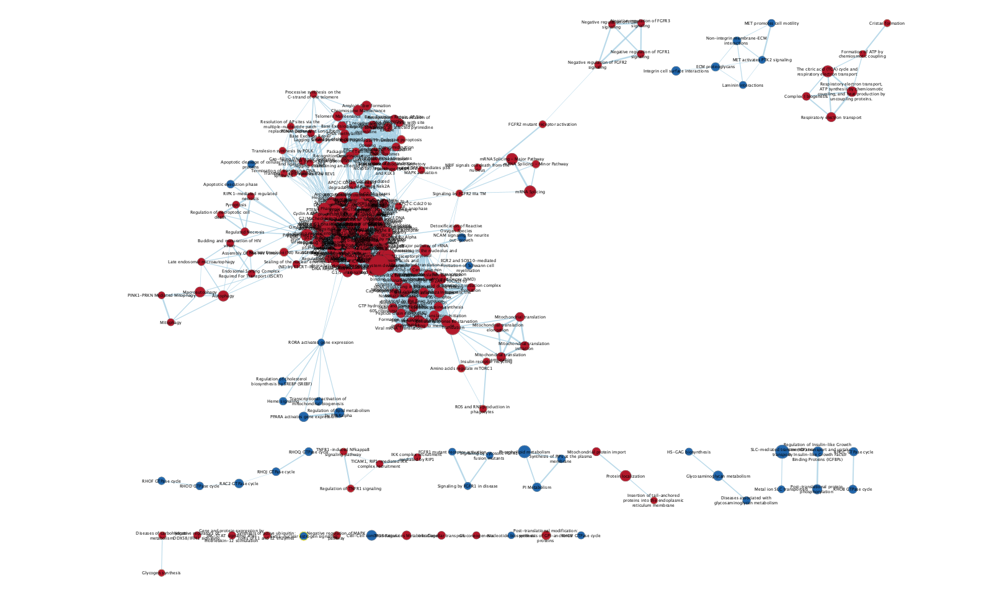
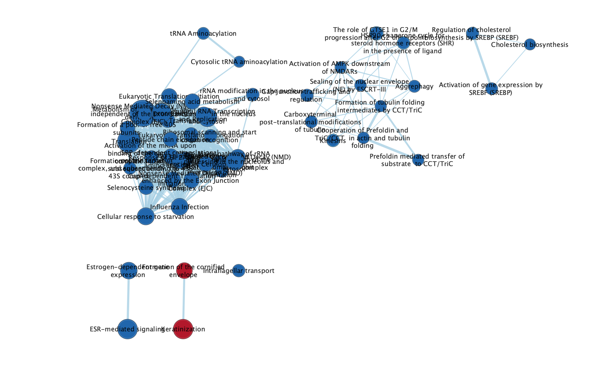
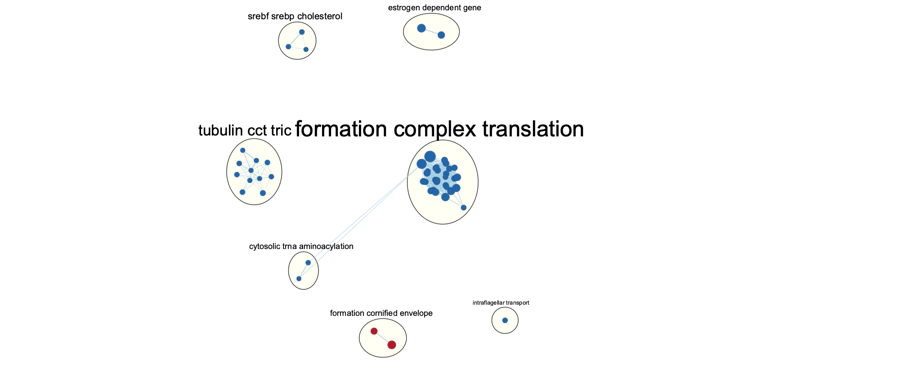
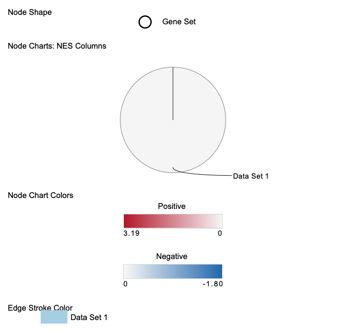
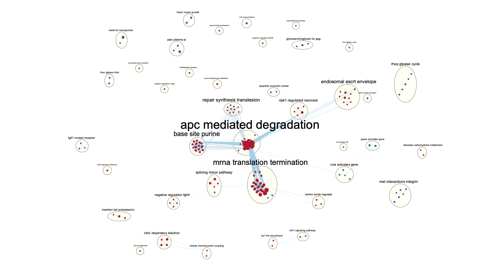
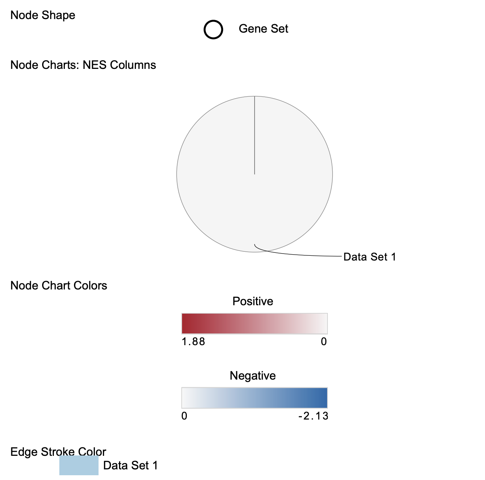
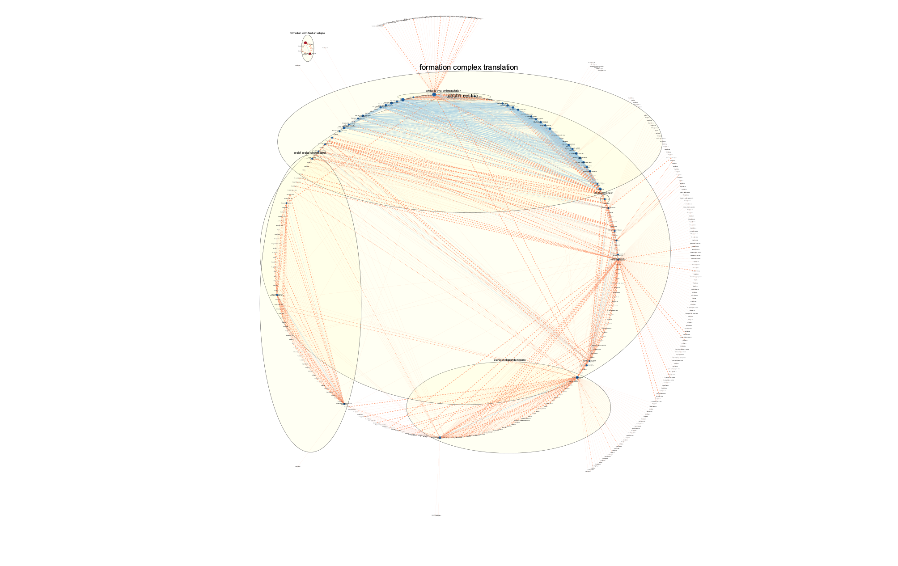

# Non-thresholded Gene set Enrichment Analysis

## Load data

## check package is installed
```{r message=FALSE, warning=FALSE, results='hide'}
if (!requireNamespace("ComplexHeatmap", quietly = TRUE))
  BiocManager::install("ComplexHeatmap")
if (!requireNamespace("circlize", quietly = TRUE))
  install.packages("circlize")
if (!requireNamespace("gprofiler2", quietly = TRUE))
  install.packages("gprofiler2")
if (!requireNamespace("kableExtra", quietly = TRUE))
  install.packages("kableExtra")
```

## Load package
```{r message=FALSE, warning=FALSE, results='hide'}
library(edgeR)
library(circlize)
library(ComplexHeatmap)
library(gprofiler2)
library(kableExtra)
```

```{r}
# Read data from assignment 1

normalized_count_data_path <- "./final_counts.csv"

# Please modify the datapath
normalized_count_data <- read.table(normalized_count_data_path, 
                                    header = TRUE, 
                                    sep = ",", 
                                    stringsAsFactors = FALSE, 
                                    check.names = FALSE)

# Find missing column names for hgnc_symbol
colnames(normalized_count_data)[1] <- "hgnc_symbol"

# Make a martix from normalized data
data_matrix <- normalized_count_data[3: ncol(normalized_count_data)]
rownames(data_matrix) <- normalized_count_data$hgnc_symbol
colnames(data_matrix) <- colnames(normalized_count_data[3: ncol(normalized_count_data)])

# Group them based on different cell types
cell_type <- unlist(strsplit(colnames(normalized_count_data[3: ncol(normalized_count_data)]), "_"))[c(FALSE, TRUE, FALSE)]
samples <- data.frame(cell_type = cell_type)

# Define model
classes <- samples$cell_type
model_design <- model.matrix(~0 + classes )

# differential expression
contrast_RecQ1CTL <- makeContrasts(
  RecQ1CTL ="classessiRecQ1-classessiCTL",
  levels=model_design)

contrast_ESR1 <- makeContrasts(
  ESR1CTL ="classessiESR1-classessiCTL",
  levels=model_design)

d = DGEList(counts=data_matrix, group=samples$cell_type)
d <- estimateDisp(d, model_design)
fit <- glmQLFit(d, model_design)

qlf.RecQ1CTL <- glmQLFTest(fit, 
                        contrast = contrast_RecQ1CTL
                        )

qlf_output_hits_RecQ1CTL <- topTags(qlf.RecQ1CTL,
                           sort.by = "PValue",
                           n = nrow(normalized_count_data), 
                           adjust.method = "BH") 

qlf.ESR1CTL <- glmQLFTest(fit, 
                        contrast = contrast_ESR1
                        )

qlf_output_hits_ESR1CTL <- topTags(qlf.ESR1CTL,
                           sort.by = "PValue",
                           n = nrow(normalized_count_data), 
                           adjust.method = "BH") 
```

## Obtain ranked lists
```{r}
# Rank output hits by +/- log fold change
qlf_output_RecQ1CTL_ranked <- qlf_output_hits_RecQ1CTL$table
qlf_output_RecQ1CTL_ranked[, "rank"] <- 
  -log(qlf_output_RecQ1CTL_ranked$PValue, base = 10) * sign(qlf_output_RecQ1CTL_ranked$logFC)
qlf_output_RecQ1CTL_ranked <- qlf_output_RecQ1CTL_ranked[order(qlf_output_RecQ1CTL_ranked$rank),]
qlf_output_RecQ1CTL_ranked <- qlf_output_RecQ1CTL_ranked["rank"]
qlf_output_RecQ1CTL_ranked <- data.frame(GeneName = rownames(qlf_output_RecQ1CTL_ranked), qlf_output_RecQ1CTL_ranked)
write.table(qlf_output_RecQ1CTL_ranked, file = "RecQ1CTL_ranked.rnk", row.names = FALSE, quote = FALSE, sep = "\t")

qlf_output_ESR1CTL_ranked <- qlf_output_hits_ESR1CTL$table
qlf_output_ESR1CTL_ranked[, "rank"] <- 
  -log(qlf_output_ESR1CTL_ranked$PValue, base = 10) * sign(qlf_output_ESR1CTL_ranked$logFC)
qlf_output_ESR1CTL_ranked <- qlf_output_ESR1CTL_ranked[order(qlf_output_ESR1CTL_ranked$rank),]
qlf_output_ESR1CTL_ranked <- qlf_output_ESR1CTL_ranked["rank"]
qlf_output_ESR1CTL_ranked <- data.frame(GeneName = rownames(qlf_output_ESR1CTL_ranked), qlf_output_ESR1CTL_ranked)
write.table(qlf_output_ESR1CTL_ranked, file = "ESR1CTL_ranked.rnk", row.names = FALSE, quote = FALSE, sep = "\t")
```

## GSEA
### 1. Paramters
I use GSEA(version 4.2.3) for Non-thresholded Gene set Enrichment Analysis with the following
parameters

* Number of permutation: 1000
* Max size: 500
* Min size: 15

Geneset: I use Reactome [@fabregat2018reactome] downloaded from gprofiler [@reimand2016g]. 

### 2. Result

#### RecQ1 vs CTL
245/1025 in upregulated, 128/1025 in downregulated are significantly enriched 
with nominal pvalue < 0.05

#### ESR1 vs CTL
50/1025 in upregualated, 83/1025 in downreagulated are significantly enriched

The result matches with the original paper that both RecQ1 and ESR1 plays a 
part in ERa signalling since ESR-mediated signaling and estrogen response is 
downregulated.

### 3. Comparison with thresholded result in A2
GSEA achieves much more genesets comparing to Gprofiler. Interesting, in RecQ1 vs CTL,
GSEA results many geneset relating to translation in upregulation. This includes
R-HSA-192823, R-HSA-156842, R-HSA-72689, R-HSA-156902, R-HSA-72764. For down
regulation, GSEA is able to find several pathways relating to neuralcell. This
includes R-HSA-375165 and R-HSA-9619665. Additionally, in ESR1 vs CTL, in upregulation,
we get genesets relating to elastic fibre such as REAC:R-HSA-2129379, notch processing such as 
REAC:R-HSA-1912422. In downregulation, we get genesets relating to translation such 
as R-HSA-192823, R-HSA-156902, R-HSA-72764, R-HSA-156842

#  Visualize your Gene set Enrichment Analysis in Cytoscape
For ESR1 vs CTL, there are 50 nodes and 406 edges, for RECQ1 vs CTL, there are 273 nodes and 6469 edges
They are both run with p-value cutoff of 0.05 and combined 50% similarity coefficient with a cutoff of 0.375.




Annotate your network - what parameters did you use to annotate the network. If you are using the default parameters make sure to list them as well.
Make a publication ready figure - include this figure with proper legends in your notebook.
Collapse your network to a theme network. What are the major themes present in this analysis? Do they fit with the model? Are there any novel pathways or themes?
Present your results with the use of tables and screenshots. All figures should have appropriate figure legends.
If using figures create a figures directory in your repo and make sure all references to the figures are relative in your Rmarkdown notebook.


I use a cytoscape app called AutoAnnotate [@kucera2016autoannotate] to annotate and group the network

Also, its legend:




Also, its legend



# Interpretation and detailed view of results


The enrichment result support conclusion discussed in the original paper. The
original paper discuss that both ESR1 and RECQ1 knockdown lead to deregulation
of estrogen pathways [@lu2021genome]. The same is  observed in both this enrichment result and 
A2.
Can you find evidence, i.e. publications, to support some of the results that you see. How does this evidence support your result?
The srebf and srebp cholesterol are downregulated, while there are evidence showing that variation of ESR1 influence HDL-cholesterol [@klos2008esr1].
Also, we found RECQ1 knockdown leads to upregulation of repair synthesis, and there are also evidence that
showing the RECQ1 is deeply involved in DNA repair


Add a post analysis to your main network using specific transcription factors, microRNAs or drugs. Include the reason why you chose the specific miRs, TFs or drugs (i.e publications indicating that they might be related to your model). What does this post analysis show?

I use drugbank dataset [@wishart2018drugbank] from BaderLab to run the post analysis of April 2022 relase.
In the research by Jae Heon Jeong et al., palbociclib, alpelisib, ribociclib, dexamethasone, checkpoint kinase inhibitor AXD 7762, irinotecan, milademetan tosylate, R05045337, cisplatin, prexasertib, and olaparib are promising
drug candidates for ESR1 [@jeong2021elucidation].

In my analysisolaparib and dexamethasone are found in ESR1 signature network. Thus,
it matches some part of other people's work. However, most of the promising drugs
from their analysis is missing. Therefore, it is possible that other drug may not 
be that promising

# Reference


